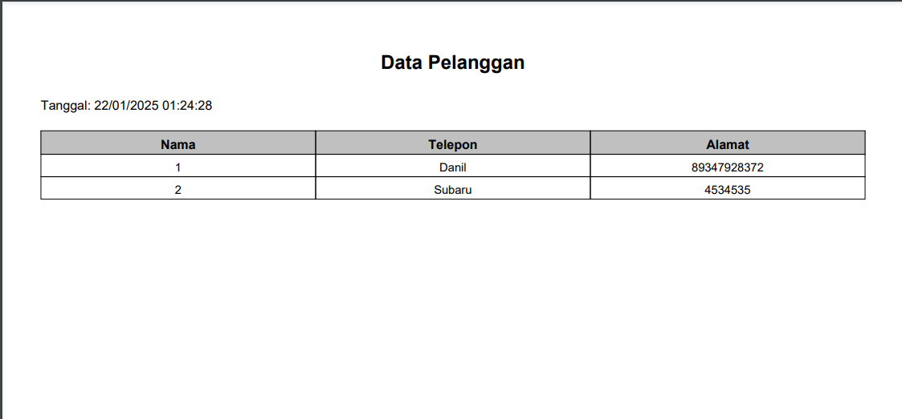

# IsmiZakia-2210010020-TB

## Deskripsi Proyek
Ini adalah repository tugas besar (TB) untuk mata kuliah Pemograman Berbasis Objek 2 (PBO2). Repository ini dibuat oleh Ismi Zakia dengan nomor mahasiswa 2210010020. Proyek ini adalah aplikasi penyewaan PC sederhana yang dirancang untuk mempermudah pengelolaan data penyewaan, pelanggan, dan perangkat PC.

## Fitur
Beberapa fitur utama yang terdapat dalam proyek ini meliputi:

- CRUD (Create, Read, Update, Delete) untuk data pelanggan, penyewaan, dan PC
- Cetak laporan penyewaan dan data lainnya

## Teknologi yang Digunakan
Proyek ini dibangun menggunakan teknologi berikut:

- Bahasa Pemrograman: Java
- Database: MySQL
- Library: 
  - JCalendar
  - iTextPDF
  - MySQL Connector

## Instalasi
Untuk menjalankan proyek ini secara lokal, ikuti langkah-langkah berikut:

1. Clone repository ini:
   ```bash
   git clone https://github.com/ismizakia/IsmiZakia-2210010020-TB.git
   ```
2. Masuk ke direktori proyek:
   ```bash
   cd IsmiZakia-2210010020-TB
   ```
3. Pastikan Anda memiliki Java Development Kit (JDK) terinstal.
4. Import proyek ini ke dalam IDE seperti NetBeans atau IntelliJ IDEA.
5. Konfigurasikan database MySQL sesuai kebutuhan:
   - Buat database baru.
   - Import file SQL yang disediakan (jika ada).
   - Ubah konfigurasi koneksi database di kode sumber jika diperlukan.

6. Jalankan aplikasi:
   ```bash
   [Perintah atau langkah untuk menjalankan aplikasi melalui IDE]
   ```

## Cara Penggunaan
Berikut adalah langkah-langkah penggunaan aplikasi:

1. Pilih menu untuk mengelola data pelanggan, PC, atau penyewaan.
2. Gunakan fungsi CRUD untuk menambah, melihat, memperbarui, atau menghapus data.
3. Cetak laporan penyewaan atau data lainnya melalui menu yang tersedia.

## Preview
Berikut adalah beberapa tampilan dari aplikasi:

### Laporan Data Pelanggan


### Laporan Sewa PC


### Laporan Data PC


### Form Penyewaan


### Form PC


### Form Pelanggan


## Kontribusi
Jika Anda ingin berkontribusi dalam proyek ini, silakan lakukan langkah-langkah berikut:

1. Fork repository ini.
2. Buat branch baru:
   ```bash
   git checkout -b feature-branch
   ```
3. Lakukan perubahan yang diinginkan.
4. Commit perubahan Anda:
   ```bash
   git commit -m "Deskripsi perubahan"
   ```
5. Push branch Anda:
   ```bash
   git push origin feature-branch
   ```
6. Buat pull request.


Terima kasih telah mengunjungi repository ini! Jangan lupa untuk memberikan bintang ⭐ jika Anda merasa proyek ini bermanfaat.
